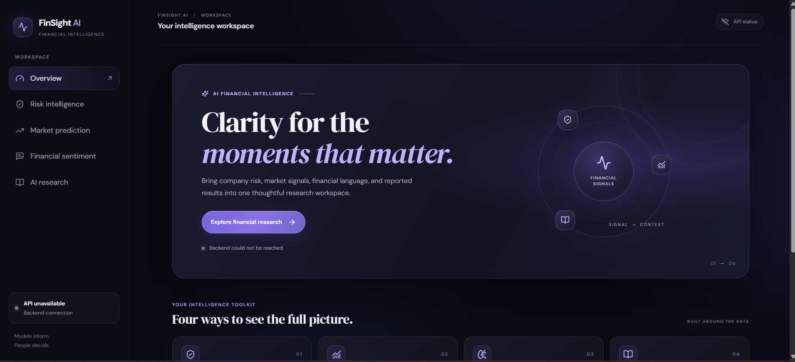
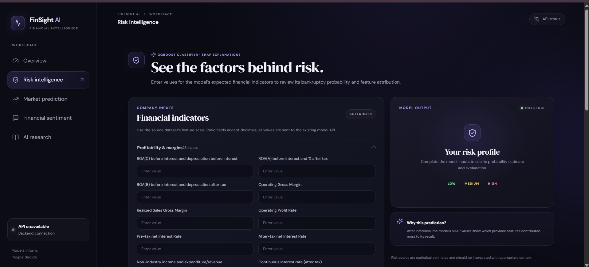
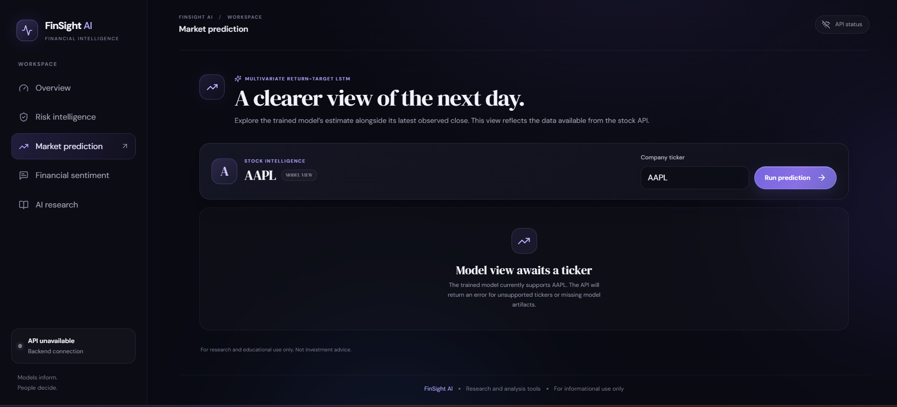
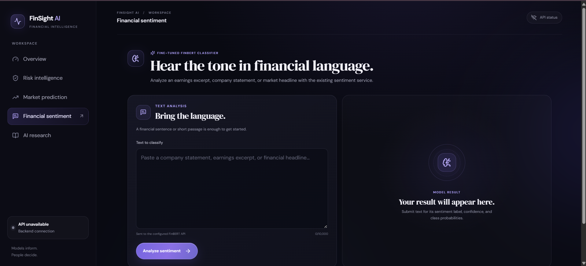
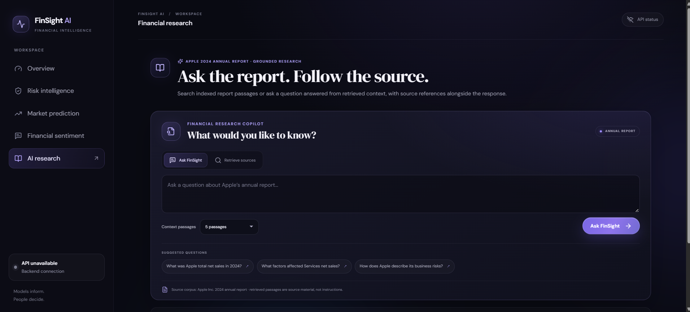

# 📈 FinSight AI

### AI-Powered Financial Risk & Investment Copilot

FinSight AI is an end-to-end financial intelligence platform that
combines **machine learning, deep learning, financial NLP, explainable
AI, Retrieval-Augmented Generation (RAG), and Gemini-powered reasoning**
into one modern full-stack application.

It provides four core workflows:

-   🏦 **Bankruptcy Risk Analysis** using XGBoost + SHAP
-   📈 **AAPL Next-Day Return Prediction** using a multivariate LSTM
-   💹 **Financial Sentiment Analysis** using fine-tuned FinBERT
-   📚 **Financial Research & Q&A** using FAISS + Sentence
    Transformers + Gemini

> **Disclaimer:** FinSight AI is an educational/research project. Its
> outputs are not financial advice and should not be used as the sole
> basis for investment, lending, or business decisions.

------------------------------------------------------------------------

## 🌐 Live Demo

### **FinSight AI --- Live Frontend**

👉 **https://fin-sight-ai-flax-gamma.vercel.app/**

The deployed interface provides the complete FinSight AI workspace and
all four product workflows.

### 🔗 Project Links

  --------------------------------------------------------------------------------------------
  Resource                            Link
  ----------------------------------- --------------------------------------------------------
  🌐 Live Demo                        https://fin-sight-ai-flax-gamma.vercel.app/

  💻 GitHub                           https://github.com/nan1027/FinSight-AI

  🤗 ML Artifacts                     https://huggingface.co/Nandita10/finsight-ai-artifacts
  --------------------------------------------------------------------------------------------

The backend is implemented as a modular **FastAPI + ML/RAG service**,
containerized with Docker and designed to run independently from the
frontend.

------------------------------------------------------------------------

## ✨ Product Overview

FinSight AI brings several financial intelligence capabilities into a
single workspace.

### 1. 🏦 Risk Intelligence

Estimate bankruptcy probability from **94 financial indicators** and
understand which features influenced the prediction through SHAP
explanations.

### 2. 📈 Market Prediction

Use a trained **multivariate return-target LSTM** to estimate the
next-day return and projected close for **AAPL**.

### 3. 💹 Financial Sentiment

Analyze financial statements, earnings excerpts, headlines, and other
financial text using a fine-tuned **FinBERT** classifier.

### 4. 📚 AI Financial Research

Search Apple's 2024 annual report and ask grounded questions. The RAG
pipeline retrieves relevant passages and uses Gemini to generate answers
with source references.

------------------------------------------------------------------------

# 🖥️ Interface Preview

## Overview



## Risk Intelligence



## Market Prediction



## Financial Sentiment



## AI Financial Research



------------------------------------------------------------------------

# 🧠 System Architecture

``` text
                              ┌────────────────────────┐
                              │       User / UI        │
                              │   React + TypeScript   │
                              └────────────┬───────────┘
                                           │
                                           ▼
                              ┌────────────────────────┐
                              │     FastAPI Backend    │
                              │       /api/v1          │
                              └────────────┬───────────┘
                                           │
             ┌─────────────────────────────┼─────────────────────────────┐
             │                             │                             │
             ▼                             ▼                             ▼
     ┌───────────────┐             ┌───────────────┐             ┌───────────────┐
     │ Risk Service  │             │ Stock Service │             │  Sentiment    │
     │   XGBoost     │             │     LSTM      │             │   FinBERT     │
     └───────┬───────┘             └───────┬───────┘             └───────┬───────┘
             │                             │                             │
             ▼                             ▼                             ▼
       Risk + SHAP                 Return + Price                Sentiment + Prob.
             │                             │                             │
             └─────────────────────────────┼─────────────────────────────┘
                                           │
                                           ▼
                              ┌────────────────────────┐
                              │      RAG Pipeline       │
                              │ Sentence Transformers  │
                              │         + FAISS        │
                              └────────────┬───────────┘
                                           │
                                           ▼
                              ┌────────────────────────┐
                              │      Gemini LLM        │
                              │ Grounded Answer Layer  │
                              └────────────────────────┘
```

### Offline model/data preparation

``` text
UCI Bankruptcy Dataset
        ↓
Preprocessing
        ↓
XGBoost Training + SHAP
        ↓
Risk Model Artifact


Yahoo Finance AAPL Data
        ↓
Feature Engineering
        ↓
LSTM Training + Evaluation
        ↓
Stock Model Artifacts


Financial PhraseBank
        ↓
Preprocessing + Stratified Splits
        ↓
FinBERT Fine-Tuning
        ↓
Sentiment Model Artifact


Apple 2024 Form 10-K
        ↓
PDF Extraction
        ↓
Structure-Aware Chunking
        ↓
MiniLM Embeddings
        ↓
FAISS Index
        ↓
RAG Artifacts
```

------------------------------------------------------------------------

# 🛠️ Technology Stack

### Frontend

-   React
-   TypeScript
-   Vite
-   React Router
-   Lucide React
-   Custom responsive CSS
-   Glassmorphism / dark AI-product UI
-   Vercel

### Backend

-   Python 3.10
-   FastAPI
-   Pydantic
-   Pydantic Settings
-   Uvicorn
-   REST APIs
-   CORS

### Machine Learning

-   Scikit-learn
-   XGBoost
-   SHAP
-   TensorFlow / Keras
-   PyTorch
-   NumPy
-   Pandas

### NLP

-   Hugging Face Transformers
-   FinBERT
-   Financial PhraseBank
-   PyTorch

### RAG

-   Sentence Transformers
-   `all-MiniLM-L6-v2`
-   FAISS
-   PyPDF
-   Google Gemini
-   `google-genai`

### Data Sources

-   UCI Taiwanese Bankruptcy Prediction Dataset
-   Yahoo Finance
-   Financial PhraseBank
-   Apple 2024 Form 10-K

### Deployment & Infrastructure

-   Vercel --- frontend
-   Docker --- backend containerization
-   Hugging Face --- ML artifact storage
-   FastAPI --- backend service architecture

------------------------------------------------------------------------

# 🏦 Module 1 --- Bankruptcy Risk Prediction

## Dataset

**Taiwanese Bankruptcy Prediction Dataset**

-   UCI Dataset ID: 572
-   6,819 companies
-   95 original financial features
-   Binary target: `Bankrupt?`
-   6,599 non-bankrupt
-   220 bankrupt
-   No missing values

A constant feature was removed during preprocessing, leaving **94 model
features**.

### Split

``` text
Train: 5,455
Test:  1,364
```

A stratified 80/20 split was used with `random_state=42`.

## Model

**XGBoost `XGBClassifier`**

``` text
n_estimators = 300
max_depth = 4
learning_rate = 0.05
subsample = 0.8
colsample_bytree = 0.8
scale_pos_weight = class imbalance ratio
```

### Held-Out Test Results

  Metric         Score
  ----------- --------
  Accuracy      96.26%
  Precision     44.26%
  Recall        61.36%
  F1 Score      51.43%
  ROC-AUC       95.81%

### Confusion Matrix

``` text
                 Predicted
              Non-Bankrupt  Bankrupt

Actual
Non-Bankrupt      1286         34
Bankrupt           17         27
```

## Explainability

**SHAP TreeExplainer** is used to identify the most influential features
for each prediction.

Top global contributors observed during evaluation included:

1.  Total Debt / Total Net Worth
2.  Borrowing Dependency
3.  Quick Ratio
4.  Retained Earnings / Total Assets
5.  Interest-Bearing Debt Interest Rate
6.  Continuous Interest Rate After Tax
7.  Persistent EPS in Last Four Seasons
8.  ROA Before Interest / Depreciation
9.  Allocation Rate Per Person
10. Non-Industry Income / Expenditure / Revenue

The API returns the **top five absolute SHAP contributors** for an
individual prediction.

------------------------------------------------------------------------

# 📈 Module 2 --- Stock Return Prediction

The served stock workflow uses a **multivariate return-target LSTM** for
**AAPL**.

> The project is deliberately scoped to AAPL for the current
> implementation. It does not claim to be a live general-purpose market
> prediction platform.

## Features

``` text
Open
High
Low
Close
Volume
Daily Return
Price Range
SMA 10
SMA 20
EMA 10
EMA 20
Volatility 10
Volume Change
```

### Sequence

``` text
60 historical trading days
            ↓
      LSTM model
            ↓
   Next-Day Return
            ↓
Projected Next-Day Close
```

## Architecture

``` text
LSTM(64)
    ↓
Dropout(0.2)
    ↓
LSTM(32)
    ↓
Dropout(0.2)
    ↓
Dense(1)
```

### Evaluation

  Metric           Score
  ------------- --------
  Price MAE         5.06
  Price RMSE        6.78
  Price MAPE       1.61%
  Return MAE      0.0162
  Return RMSE     0.0217

### Persistence Baseline

``` text
MAE  = 4.28
RMSE = 6.08
MAPE = 1.37%
```

The baseline comparison is intentionally included to avoid overstating
the model's predictive ability.

------------------------------------------------------------------------

# 💹 Module 3 --- Financial Sentiment Analysis

## Dataset

**Financial PhraseBank**

``` text
Total examples: 2,264

Train: 1,811
Validation: 227
Test: 226
```

Duplicate texts were prevented from crossing dataset splits.

## Model

Base model:

``` text
ProsusAI/finbert
```

Fine-tuning:

``` text
Learning Rate: 2e-5
Batch Size: 8
Epochs: 3
Max Length: 128
Weight Decay: 0.01
Seed: 42
```

### Held-Out Test Results

  Metric           Score
  ------------- --------
  Accuracy        97.79%
  Macro F1        97.29%
  Weighted F1     97.80%

The API returns:

-   Positive / Negative / Neutral sentiment
-   Confidence
-   Probability for each class

------------------------------------------------------------------------

# 📚 Module 4 --- Financial Research / RAG

The RAG knowledge base currently contains Apple's **2024 Form 10-K /
Annual Report**.

## Document Pipeline

``` text
Apple 2024 Annual Report
          ↓
      PDF Extraction
          ↓
Structure-Aware Chunking
          ↓
      134 Chunks
          ↓
MiniLM Embeddings
          ↓
      FAISS Index
          ↓
 Semantic Retrieval
          ↓
    Gemini Answer
          ↓
 Answer + Sources
```

### Embeddings

``` text
Model:
sentence-transformers/all-MiniLM-L6-v2

Dimensions:
384

Similarity:
Cosine similarity
```

### Retrieval Evaluation

8 project questions were used for a small internal retrieval evaluation.

  Metric       Result
  ---------- --------
  Recall@1      75.0%
  Recall@3       100%
  Recall@5       100%

These results are a project-level evaluation, not a broad RAG benchmark.

## Grounding & Safety

The answer layer is designed to:

-   Use retrieved passages as source material
-   Generate answers only from retrieved context
-   Return source references
-   Say when available context is insufficient
-   Avoid unsupported claims
-   Ignore prompt-like instructions inside retrieved documents
-   Avoid unnecessary Gemini calls when no useful context is retrieved

------------------------------------------------------------------------

# 🔌 API Architecture

All versioned endpoints use:

``` text
/api/v1
```

  -----------------------------------------------------------------------------
  Method                  Endpoint                      Purpose
  ----------------------- ----------------------------- -----------------------
  GET                     `/api/v1/health`              API health

  POST                    `/api/v1/risk/predict`        Bankruptcy
                                                        probability + SHAP

  POST                    `/api/v1/stock/predict`       AAPL next-day return +
                                                        projected close

  POST                    `/api/v1/sentiment/predict`   Financial sentiment +
                                                        probabilities

  POST                    `/api/v1/rag/retrieve`        Retrieve relevant
                                                        annual-report chunks

  POST                    `/api/v1/rag/ask`             Grounded Gemini
                                                        answer + sources
  -----------------------------------------------------------------------------

FastAPI also exposes interactive API documentation through `/docs`.

------------------------------------------------------------------------

# 🧪 Testing & Validation

The project includes automated validation for:

-   API health
-   Risk inference
-   Exact risk feature validation
-   Stock inference
-   Sentiment inference
-   RAG retrieval
-   RAG answer generation
-   Empty-context behavior
-   Prompt-injection resistance
-   Artifact resolution

### Validation Status

``` text
Backend test suite: 35 passed
Frontend TypeScript check: PASS
Frontend production build: PASS
Docker image build: PASS
Docker container startup: PASS
Docker health endpoint: PASS
```

------------------------------------------------------------------------

# 📦 ML Artifact Management

Large model artifacts are intentionally kept outside the Git source
tree.

The production artifact bundle contains:

``` text
Risk
├── XGBoost model
└── model metadata

Stock
├── LSTM model
├── feature scaler
├── target scaler
├── metadata
└── engineered AAPL data

Sentiment
├── Fine-tuned FinBERT
├── tokenizer
└── model metadata

RAG
├── FAISS index
├── embedding metadata
├── embeddings
└── index metadata
```

Artifacts are stored in a dedicated Hugging Face Model repository:

👉 https://huggingface.co/Nandita10/finsight-ai-artifacts

The backend contains an artifact resolver that can use local artifacts
or retrieve missing production artifacts from the configured Hugging
Face repository.

------------------------------------------------------------------------

# 🐳 Docker

FinSight AI includes a multi-stage Docker setup.

``` text
Node.js stage
      ↓
Build React frontend
      ↓
Python 3.10 runtime
      ↓
FastAPI + ML/RAG services
```

### Build

``` bash
docker build -t finsight-ai:local .
```

### Run

``` bash
docker run --rm -p 8080:8080 --env-file .env finsight-ai:local
```

### Health Check

``` text
http://localhost:8080/api/v1/health
```

The container uses CPU-oriented PyTorch dependencies because the
deployed inference workflows do not require a GPU.

------------------------------------------------------------------------

# 📁 Project Structure

``` text
FinSight-AI/
│
├── backend/
│   ├── api/
│   │   └── v1/
│   ├── database/
│   ├── models/
│   ├── schemas/
│   ├── services/
│   │   ├── rag/
│   │   ├── risk/
│   │   ├── sentiment/
│   │   └── stock/
│   ├── config.py
│   └── main.py
│
├── frontend/
│   ├── src/
│   │   ├── components/
│   │   ├── pages/
│   │   ├── api.ts
│   │   ├── App.tsx
│   │   └── style.css
│   └── package.json
│
├── ml/
│   ├── risk_prediction/
│   ├── sentiment/
│   └── stock_prediction/
│
├── rag/
│   ├── documents/
│   ├── embeddings/
│   ├── ingestion/
│   └── retrieval/
│
├── data/
│   ├── raw/
│   └── processed/
│
├── notebooks/
├── tests/
├── Dockerfile
├── requirements.txt
├── requirements-docker.txt
├── .dockerignore
└── README.md
```

------------------------------------------------------------------------

# ⚙️ Local Setup

## 1. Clone

``` bash
git clone https://github.com/nan1027/FinSight-AI.git
cd FinSight-AI
```

## 2. Create virtual environment

### Windows

``` powershell
py -m venv .venv
.\.venv\Scripts\Activate.ps1
```

## 3. Install backend dependencies

``` powershell
python -m pip install -r requirements.txt
```

## 4. Configure environment

Create `.env` from `.env.example`.

``` env
APP_NAME=FinSight AI
APP_ENV=development
API_V1_PREFIX=/api/v1

GEMINI_API_KEY=your_gemini_api_key
FINSIGHT_LLM_MODEL=gemini-3.5-flash-lite

FINSIGHT_HF_REPO_ID=Nandita10/finsight-ai-artifacts
HF_TOKEN=your_huggingface_token
```

Never commit API keys or `.env`.

## 5. Start backend

``` powershell
python -m uvicorn main:app --app-dir backend --reload --host 127.0.0.1 --port 8000
```

## 6. Start frontend

``` powershell
cd frontend
npm ci
npm run dev
```

Vite normally starts on:

``` text
http://localhost:5173
```

------------------------------------------------------------------------

# 🚀 Deployment Architecture

``` text
                    GitHub
                       │
              ┌────────┴────────┐
              │                 │
              ▼                 ▼
          Vercel           Backend Runtime
          Frontend             │
                               ▼
                         FastAPI Service
                               │
        ┌──────────────────────┼──────────────────────┐
        │                      │                      │
      XGBoost                LSTM                  FinBERT
        │                      │                      │
        └──────────────────────┼──────────────────────┘
                               │
                              RAG
                               │
                             Gemini
                               │
                               ▼
                       Grounded Responses
```

### Current deployment

-   **Frontend:** deployed on Vercel
-   **Backend:** Dockerized and deployment-ready
-   **Artifacts:** stored separately on Hugging Face
-   **Frontend/backend:** intentionally separated so the ML-heavy
    backend can be scaled independently

------------------------------------------------------------------------

# 🎯 Engineering Highlights

FinSight AI demonstrates:

### Machine Learning

-   Imbalanced binary classification
-   XGBoost
-   SHAP explainability
-   Model evaluation

### Deep Learning

-   LSTM time-series modeling
-   Multivariate feature engineering
-   Return-target prediction
-   Persistence baseline comparison

### NLP

-   Financial-domain language modeling
-   FinBERT fine-tuning
-   Stratified dataset splitting
-   Held-out evaluation

### Generative AI

-   Gemini
-   Retrieval-Augmented Generation
-   Semantic search
-   Grounded answers
-   Source attribution
-   Prompt-injection resistance

### Software Engineering

-   Modular FastAPI services
-   Versioned REST APIs
-   Pydantic validation
-   Frontend/backend separation
-   Automated testing
-   Docker
-   ML artifact resolution
-   Production-oriented configuration

------------------------------------------------------------------------

# ⚠️ Limitations

-   Stock prediction currently supports **AAPL only**.
-   Stock inference uses historical/local data rather than a live
    market-data feed.
-   The RAG corpus currently focuses on Apple's 2024 annual report.
-   Risk prediction depends on the exact 94-feature input schema.
-   Model evaluation results are project-level experiments and are not
    guarantees of real-world performance.
-   FinSight AI is not financial advice.

------------------------------------------------------------------------

# 🔮 Future Improvements

Planned extensions include:

-   Broader stock/ticker support
-   Live market-data integration
-   Larger financial-document corpus
-   More comprehensive RAG evaluation
-   Model monitoring
-   Portfolio-level risk analysis
-   Additional financial datasets
-   Production backend deployment and scaling
-   Improved artifact versioning and reproducibility

------------------------------------------------------------------------

# 👩‍💻 Author

## Nandita Rishishwar

**B.Tech --- Computer Science & Engineering**\
VIT Bhopal University

### Links

-   🌐 Live Demo: https://fin-sight-ai-flax-gamma.vercel.app/
-   💻 GitHub: https://github.com/nan1027/FinSight-AI
-   🤗 Hugging Face Artifacts:
    https://huggingface.co/Nandita10/finsight-ai-artifacts

------------------------------------------------------------------------

## ⭐ FinSight AI

**Turning financial data into explainable intelligence.**
