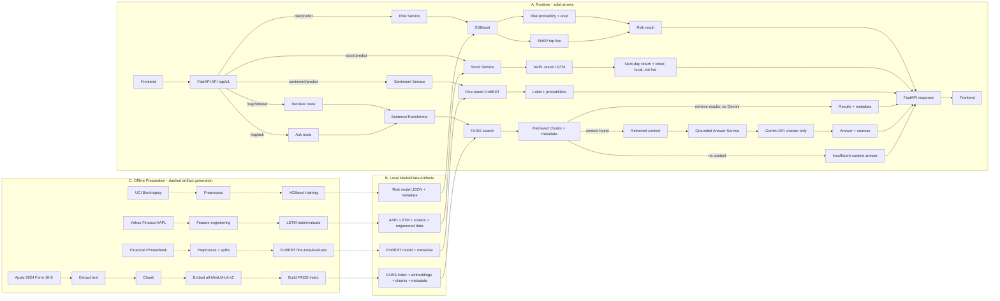

# FinSight AI

FinSight AI is a local financial analysis application that brings together bankruptcy-risk inference, AAPL next-day return prediction, financial-text sentiment classification, and grounded question answering over an Apple 2024 annual report. A React and TypeScript frontend communicates with a FastAPI backend that loads the project's local model and retrieval artifacts. FinSight AI is an educational/research project, not investment advice.

## Overview

FinSight AI currently provides four implemented workflows:

- **Bankruptcy Risk Analysis** — estimates bankruptcy probability from 94 financial features and returns a risk category with SHAP contributors.
- **Stock Return Prediction** — predicts a next-day return and projected closing price for **AAPL only**.
- **Financial Sentiment Analysis** — classifies a financial text snippet as positive, negative, or neutral.
- **Financial Research / RAG** — retrieves relevant passages from an indexed Apple Inc. 2024 Form 10-K and can use Gemini to generate an answer grounded in those passages.

This is a local financial-analysis application. Stock inference is limited to AAPL and uses local data; the research corpus is limited to the Apple 2024 annual report. It is not a live or general market-data platform, a general-purpose financial research platform, or investment advice.

## Key Features

- Bankruptcy probability, Low/Medium/High category, and five leading SHAP contributors.
- AAPL next-day return and projected close from a multivariate return-target LSTM.
- Financial sentence sentiment with confidence and per-class probabilities.
- Semantic search and Gemini answer generation over the local annual-report corpus, with source references.
- React/TypeScript views integrated with versioned FastAPI endpoints.

## System Architecture



The RAG retrieval endpoint returns retrieved chunks directly. The RAG ask endpoint retrieves context and passes it to the answer-generation provider; when there is no retrieved context, the answer service returns an insufficient-context response without calling the LLM.

## ML & RAG Components

### 1. Bankruptcy Risk Prediction

The risk workflow uses an **XGBoost `XGBClassifier`** with 94 named financial input features. It returns a bankruptcy probability and maps that result to Low, Medium, or High risk. **SHAP TreeExplainer** supplies the five feature contributions with the largest absolute SHAP values for the prediction.

No risk-model evaluation metrics are included here because the repository metadata does not provide a documented evaluation result.

### 2. Stock Return Prediction

The stock workflow runs a **multivariate return-target LSTM** for **AAPL only**. It uses 13 engineered features over a 60-step input sequence, predicts a next-day return, and derives a projected next close from the latest close in the local engineered dataset. Inference requires local model, scaler, metadata, and processed-data artifacts.

This output is a model prediction, not live pricing or a guarantee. The repository does not provide a committed numeric evaluation result supporting a claim that the model outperforms a persistence baseline.

### 3. Financial Sentiment Analysis

The sentiment workflow uses a fine-tuned **`ProsusAI/finbert`** model trained using the **Financial PhraseBank** data. It returns positive, negative, or neutral sentiment with confidence and probabilities for all three classes.

The following are the repository's recorded **held-out test-set results** (226 test examples), not production guarantees:

| Metric | Test result |
| --- | ---: |
| Accuracy | 0.9779 |
| Macro F1 | 0.9729 |
| Weighted F1 | 0.9780 |

### 4. Financial Research / RAG

The RAG corpus is Apple's **2024 Form 10-K** represented as 134 chunks. Retrieval uses **`sentence-transformers/all-MiniLM-L6-v2`** embeddings with 384 dimensions, a **FAISS** index, and cosine similarity. The answer-generation layer uses the Google Gemini SDK and the configured Gemini model. It instructs the model to answer only from retrieved context, treat retrieved text as source material rather than instructions, avoid unsupported facts, and cite source references when possible. Responses include references to the retrieved chunks.

The repository's evaluation covers **eight project questions**. The reported values are a small project evaluation, not a general retrieval benchmark or production guarantee:

| Metric | Project evaluation |
| --- | ---: |
| Recall@1 | 0.750 |
| Recall@3 | 1.000 |
| Recall@5 | 1.000 |

## Frontend

The React and TypeScript application contains five views:

- **Overview** — service status and entry points to the analysis workflows.
- **Risk** — feature input and risk prediction results.
- **Stock** — AAPL next-day model output.
- **Sentiment** — financial text input and classification results.
- **Research** — document retrieval and grounded question answering with source references.

The frontend includes responsive styling and calls the existing backend API. During development, Vite proxies `/api` requests to the local FastAPI server.

## API Endpoints

All endpoints use the configured API prefix, which defaults to `/api/v1`.

| Method | Path | Purpose |
| --- | --- | --- |
| `GET` | `/api/v1/health` | Return API health status. |
| `POST` | `/api/v1/risk/predict` | Predict bankruptcy probability and return risk category and SHAP contributors. |
| `POST` | `/api/v1/stock/predict` | Predict the next-day AAPL return and projected close. |
| `POST` | `/api/v1/sentiment/predict` | Classify a financial text snippet and return class probabilities. |
| `POST` | `/api/v1/rag/retrieve` | Retrieve matching chunks from the annual-report corpus. |
| `POST` | `/api/v1/rag/ask` | Retrieve context and generate a grounded answer with source references. |

## API Reference

The API prefix is configurable and defaults to `/api/v1`. Request bodies are JSON. Invalid request models return FastAPI's standard `422` validation response. The response examples below are schema illustrations; dynamic outputs use pseudo-JSON type placeholders and are not literal, copy-pasteable API responses.

### `GET /api/v1/health`

Returns API process health. It does **not** verify that ML models or RAG artifacts are ready.

- **Request:** No body.
- **Response:** `status` and `service` strings.

```json
{"status":"ok","service":"FinSight AI API"}
```

### `POST /api/v1/risk/predict`

Predicts bankruptcy probability and returns the top SHAP contributors.

- **Request:** Required `features` object mapping every exact trained feature name to a numeric value. The required feature set is recorded in [`ml/risk_prediction/model_metadata.json`](ml/risk_prediction/model_metadata.json); the model uses 94 features. To avoid suggesting incomplete or fabricated inputs, no partial feature payload is shown.
- **Validation:** Missing or extra feature names return **400**. Invalid body/value types return **422**.
- **Response:** `bankruptcy_probability`, `risk_level`, and `top_contributors` entries (`feature`, `shap_value`).
- **Other errors:** **500** if the risk model or metadata file is missing.

**Response schema illustration (pseudo-JSON; placeholders are types, not values):**

```text
{
  "bankruptcy_probability": <number>,
  "risk_level": <string>,
  "top_contributors": [{"feature": <string>, "shap_value": <number>}]
}
```

### `POST /api/v1/stock/predict`

Predicts next-day return and projected close using the local AAPL model and engineered data. This is **not** a live-market lookup. Only `AAPL` is supported.

- **Request:** Optional `ticker` string; defaults to `"AAPL"`.
- **Validation:** Any other ticker returns **400**.
- **Response:** `ticker`, `latest_close`, `predicted_next_day_return`, `predicted_next_close`, `model_type`, and `sequence_length`.
- **Other errors:** **500** if model or artifact files are missing.

**Request example:**

```json
{"ticker":"AAPL"}
```

**Response schema illustration (pseudo-JSON; placeholders are types, not values):**

```text
{
  "ticker": <string>,
  "latest_close": <number>,
  "predicted_next_day_return": <number>,
  "predicted_next_close": <number>,
  "model_type": <string>,
  "sequence_length": <integer>
}
```

### `POST /api/v1/sentiment/predict`

Classifies a financial text snippet with the saved FinBERT model.

- **Request:** Required `text` string.
- **Validation:** Empty or whitespace-only text returns **400**; a missing or non-string value returns **422**.
- **Response:** `sentiment`, `confidence`, and `probabilities` with `negative`, `neutral`, and `positive` values.
- **Other errors:** **500** if the sentiment model or metadata is missing.

**Request example:**

```json
{"text":"<financial text to classify>"}
```

**Response schema illustration (pseudo-JSON; placeholders are types, not values):**

```text
{
  "sentiment": <string>,
  "confidence": <number>,
  "probabilities": {"negative": <number>, "neutral": <number>, "positive": <number>}
}
```

### `POST /api/v1/rag/retrieve`

Searches the local FAISS index and returns matching annual-report chunks and metadata. This endpoint does **not** call Gemini.

- **Request:** Required `query` string; optional `top_k` integer, default `5`.
- **Validation:** `top_k` must be from `1` through `10` (inclusive). Empty query returns **422**; whitespace-only query returns **400**.
- **Response:** Original `query` and `results`; each result contains `chunk_id`, `score`, `text`, and `metadata`.
- **Other errors:** **500** if the retrieval index or document artifacts are unavailable.

**Request example:**

```json
{"query":"<question to search>","top_k":5}
```

**Response schema illustration (pseudo-JSON; placeholders are types, not values):**

```text
{
  "query": <string>,
  "results": [{"chunk_id": <string>, "score": <number>, "text": <string>, "metadata": <object>}]
}
```

### `POST /api/v1/rag/ask`

Retrieves report context first, then generates a grounded answer with the configured Gemini provider when context is available.

- **Request:** Required `query` string; optional `top_k` integer, default `5`.
- **Validation:** `query` must remain non-empty after trimming; `top_k` must be from `1` through `10` (inclusive). Invalid values return **422**.
- **Response:** `query`, generated `answer`, and `sources` containing retrieved chunk IDs and metadata.
- **Behavior:** If retrieval returns no chunks, the answer service returns its insufficient-context response without calling Gemini.
- **Other errors:** **500** for retrieval failure, unavailable/unconfigured Gemini provider, or answer-generation failure.

**Request example:**

```json
{"query":"<question about the report>","top_k":5}
```

**Response schema illustration (pseudo-JSON; placeholders are types, not values):**

```text
{
  "query": <string>,
  "answer": <string>,
  "sources": [{"chunk_id": <string>, "metadata": <object>}]
}
```

### OpenAPI documentation

FastAPI exposes interactive documentation at `/docs` and the OpenAPI schema at `/openapi.json`.
## Tech Stack

- **Frontend:** React, TypeScript, Vite, React Router.
- **Backend:** Python, FastAPI, Pydantic Settings, Uvicorn.
- **Machine learning:** XGBoost, SHAP, TensorFlow/Keras, scikit-learn.
- **NLP:** PyTorch, Hugging Face Transformers, FinBERT.
- **RAG:** Sentence Transformers, FAISS, PDF/text ingestion and chunking utilities.
- **LLM:** Google Gemini through the `google-genai` Python SDK.

## Project Structure

```text
.
├── backend/                 FastAPI app, API routes, schemas, service adapters
├── data/                    Local raw and processed data/artifacts
├── frontend/                React + TypeScript + Vite application
├── ml/
│   ├── risk_prediction/     XGBoost model metadata, training and evaluation code
│   ├── sentiment/           FinBERT workflow, metadata, evaluation and documentation
│   └── stock_prediction/    LSTM workflows, feature engineering and evaluation
├── notebooks/               Analysis notebooks
├── rag/
│   ├── documents/           Annual-report chunks and document metadata
│   ├── embeddings/          Embedding generation and metadata
│   ├── ingestion/           Document extraction, chunking and validation
│   └── retrieval/           FAISS index, retrieval code and evaluation
├── tests/                   Project-level tests
├── .env.example             Backend environment-variable template
└── requirements.txt         Python dependency declarations
```

## Local Development

The commands below show the repository's Windows development workflow. Replace the example repository path with the location where you cloned the project.

### Backend

```powershell
cd C:\path\to\FinSight-AI
py -m venv .venv
.\.venv\Scripts\Activate.ps1
python -m pip install -r requirements.txt
Copy-Item .env.example .env
python -m uvicorn main:app --app-dir backend --reload --host 127.0.0.1 --port 8000
```

### Frontend

In a separate terminal:

```powershell
cd C:\path\to\FinSight-AI\frontend
npm ci
npm run dev
```

The frontend's configured development API base is `http://localhost:8000/api/v1`. For frontend checks and a production build, run from `frontend/`:

```powershell
npm run typecheck
npm run build
```

### Setup Caveats

- `requirements.txt` currently does **not** declare TensorFlow, although the stock inference service imports TensorFlow/Keras, or SHAP, although the risk inference service imports SHAP. A clean environment may need those dependencies installed separately before those inference paths can run.
- RAG retrieval imports FAISS, but no FAISS package is declared in `requirements.txt`; install the appropriate FAISS package separately before running retrieval in a clean environment.
- `pytest` is not listed in `requirements.txt`; install it separately with `python -m pip install pytest`, then run `python -m pytest` from the repository root.
- Stock inference depends on local model, scaler, metadata, and processed-data artifacts. Any checkout or environment missing these local artifacts will not have the complete stock inference inputs.
- Gemini answer generation requires `GEMINI_API_KEY`; retrieval does not require an LLM API key.


## Environment Variables

Set backend variables in a local `.env` file based on `.env.example`. Do not commit secrets.

| Variable | Current default/example | Purpose |
| --- | --- | --- |
| `APP_NAME` | `FinSight AI` | FastAPI application title. |
| `APP_ENV` | `development` | Application environment label. |
| `API_V1_PREFIX` | `/api/v1` | Prefix for versioned API routes. |
| `CORS_ORIGINS` | `http://localhost:5173,http://127.0.0.1:5173,http://localhost:3000` | Comma-separated browser origins allowed by the backend. |
| `GEMINI_API_KEY` | Empty in `.env.example` | Gemini credential used for answer generation. Supply it locally; do not publish it. |
| `FINSIGHT_LLM_MODEL` | `gemini-2.5-flash-lite` | Gemini model used by the answer-generation provider. |
| `VITE_API_BASE_URL` | `http://localhost:8000/api/v1` | Frontend API base URL, documented in `frontend/.env.example`. |

## Limitations

- Stock inference is limited to AAPL and requires local model and data artifacts.
- Stock output is a model prediction; the application does not provide live market data.
- RAG answers are grounded in the local Apple 2024 Form 10-K corpus, not a general financial-document collection.
- This project is not investment advice or a general financial research platform.
- The reported sentiment and retrieval metrics describe repository evaluations only; they are not production performance guarantees.
- No deployment or hosted-service configuration is documented here.

## Future Improvements

Possible future work, not currently implemented, includes broader ticker and data support, live market-data integration, a richer financial-document corpus, expanded evaluation and monitoring, production deployment, and more complete dependency/artifact reproducibility.

## License

A project license has not yet been specified. Review applicable dataset, source-document, and model terms before redistribution or use.


